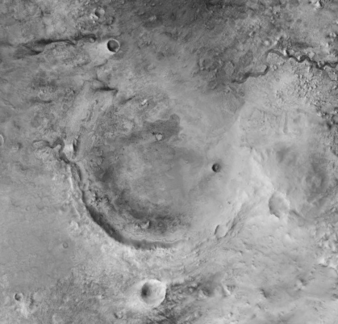
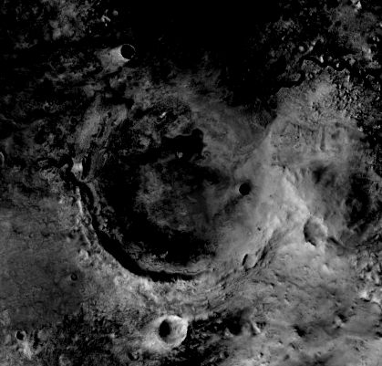

<div align="center">

# GrayscaleStretch

### Scaling the contrast of grayscaled images

[Introduction](#introduction) • [License](#license)

</div>

<hr>

## Introduction

This project is a simple Java application that scales the contrast of grayscaled images.
It calculates a percentile of the gray values in the image and then scales them to the full range of 0 to 255.
The percentile can be adjusted by the user.

## Example

| Original                   | Output                    |
|----------------------------|---------------------------|
|  |  |

The images above show a top view of the Jezero crater on Mars, taken from the [interactive map](https://murray-lab.caltech.edu/CTX/V01/SceneView/MurrayLabCTXmosaic.html) of the [Global CTX Mosaic of Mars](https://murray-lab.caltech.edu/CTX/). Special thanks to the scientists and engineers at [Malin Space Science Systems](http://www.msss.com/) and the [Jet Propulsion Laboratory](https://www.jpl.nasa.gov/), who have built and operated CTX.


### Usage

The application can be run from the command line with the following command:

```sh
java -jar GrayscaleSwitch.jar input.png output.png
```

or with adjusted values for the percentiles:
    
```sh
java -jar GrayscaleSwitch.jar input.png output.png 0.25 0.9
```

## License

This project is licensed under the terms of the MIT license. For more information, see the [LICENSE](LICENSE) file.
